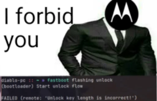

## About

> [!WARNING]
> **MOTOROLA SHITTY FIRMWARE WARNING**
> 
> Motorola really has shitty firmware.
> Carefully read all the warnings in the documentation, and if something doesn’t work - **DO NOT CONTINUE, THERE IS A RISK OF BRICKING YOUR DEVICE!**
> **Don't cry later and don't say we didn't warn you...**

This documentation is dedicated to discoveries made by me and other people interested in unlocking the Moto G23 and Moto G13 bootloader.

## Contributing

For any new discovery made that is still not on this documentation, please send a Pull Request or open an issue on [our documentation repo](https://github.com/moto-penangf/documentation) describing the discovery. 
For discoveries not yet assessed, consider starting a new discussion [here](https://github.com/orgs/moto-penangf/discussions) for further analysis.

## Credits

Special thanks to [DiabloSat](https://github.com/progzone122) and the [Helio G85 telegram group](https://t.me/motoheliog85) for providing crucial intel and testing hardware stuff.

