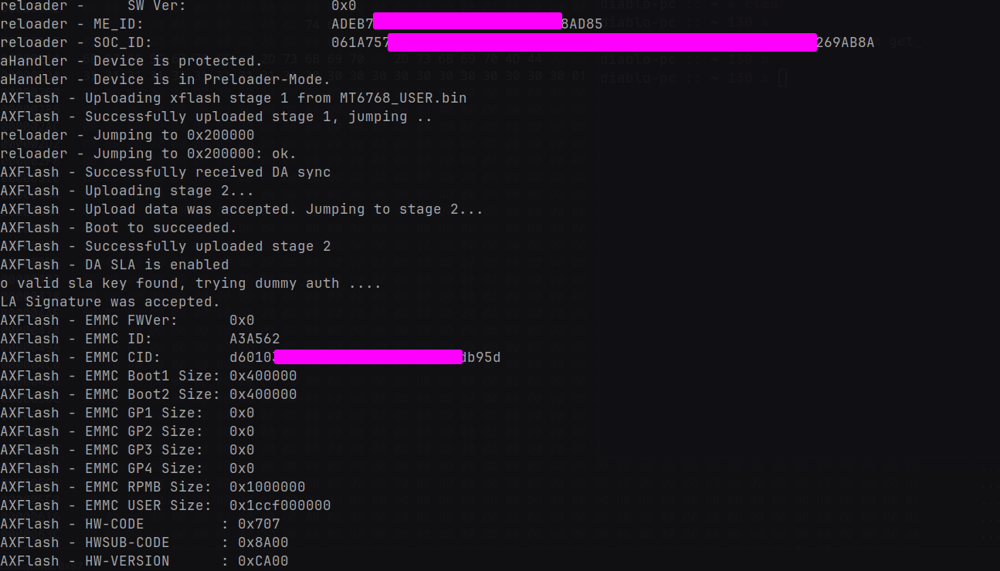

# OEM key generation algorithm
> [!NOTE]
> In the process of learning new information. The information may be incorrect

## Example of a valid key
```text
311D34773D275A92F485B3C2505F411D
```

## Known information about the key
1. Key length 32 symbols
2. The key can only consist of numbers and Cyrillic letters
3. Very similar to an MD5 hash
4. In theory, the **serial number / IMEI / output of the ```fastboot oem get_socid```** command can be used for generation key

## MD5 Hash?
[MD5 Hash online generator](https://www.md5hashgenerator.com/)

There is a possibility that the OEM key is an md5 hash, because when generating the hash (no matter how many characters) we get the same length as a valid OEM key

| String               | MD5 Hash                          | Length |
|----------------------|-----------------------------------|--------|
| text                 | 1cb251ec0d568de6a929b520c4aed8d1  | 32     |
| TEXT                 | 61a96ffcb251bb9bf0abf8fec19d0ea8  | 32     |
| abcdef12345678901234 | 1cddda3f419e889d62234b91466400a7  | 32     |

## More input data with mtkclient
The mtkclient utility gives **not only SOC_ID** (it is a combination of two keys from the ```fastboot oem get_socid``` command), but **also outputs ME_ID, EMMC CID and so on**

This can be useful for key generation



## Useful links
- [mt6765 little-kernel source code](https://github.com/moto-penangf/lk-mt6765)