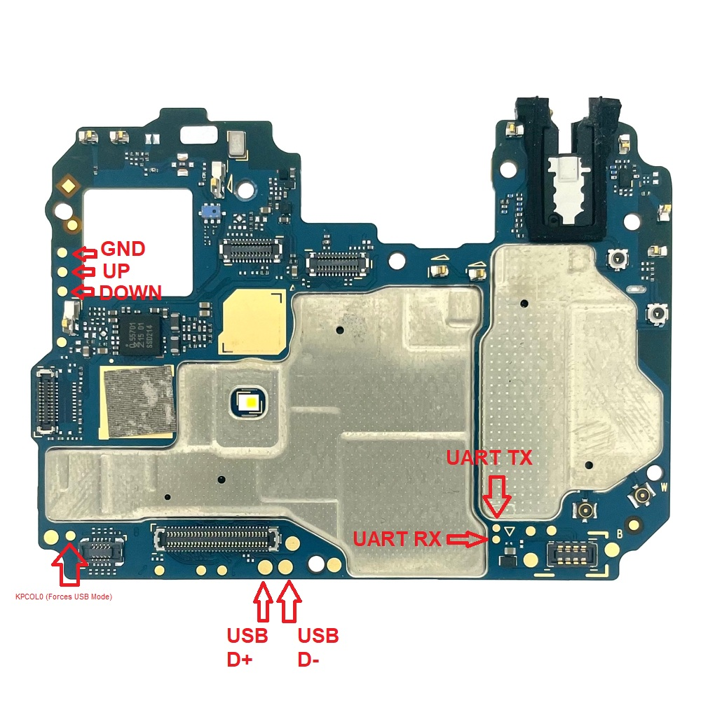
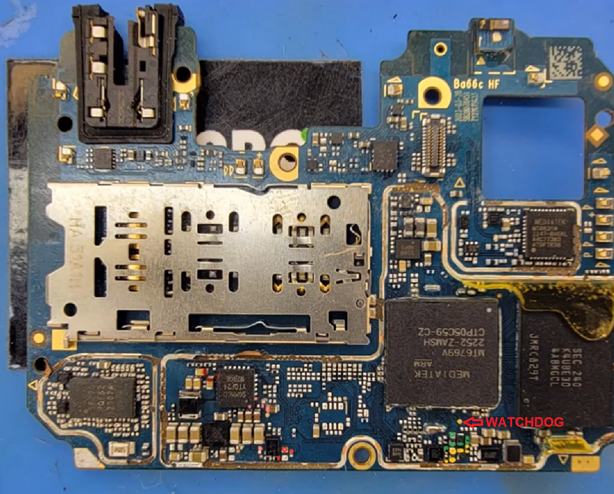

# Testpoints

## Moto G23

> [!ERROR]
> #### BE CAREFUL WITH UART CONNECTION
> There is a possibility that this could **throw off the battery calibration or even break the charge controller** (Still investigating what happened)
> 
> **Sources:**  
> [Incident](https://github.com/orgs/moto-penangf/discussions/2)  
> [Even more information about the incident](https://github.com/moto-penangf/penangf-schematics/issues/1#issuecomment-2558088916)

### FRONT:

### BACK:

*BACK PICTURE COMES FROM [THIS](https://www.youtube.com/watch?v=Y-8yj6qbFQ4) VIDEO*
