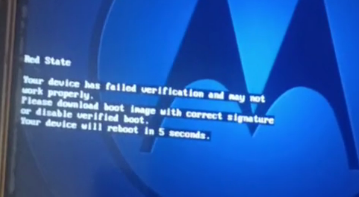

## AVB (Android Verify Boot)

### What is AVB?
AVB (Android Verified Boot) is a technology that verifies the integrity of the Android system at boot. It ensures that system partitions have not been modified using cryptographic signatures. If the verification fails, the device may not boot.

### Is it possible to disable AVB?
To disable AVB usually use modified vbmeta, but in our case if you modify vbmeta, boot, vendor_boot and so on - the device will go to “Red State” and stop booting.
This happens due to system integrity violation when the bootloader is locked.

To prevent this error, you need to unlock the bootloader to put the device into the “Orange State” to disable signature verification

### Next steps
If Red State didn't block the Recovery boot, we could run TWRP, but unfortunately that's not possible.

We need to **find a way to force the device into BROM mode** to disable AVB verification or unlock the bootloader.