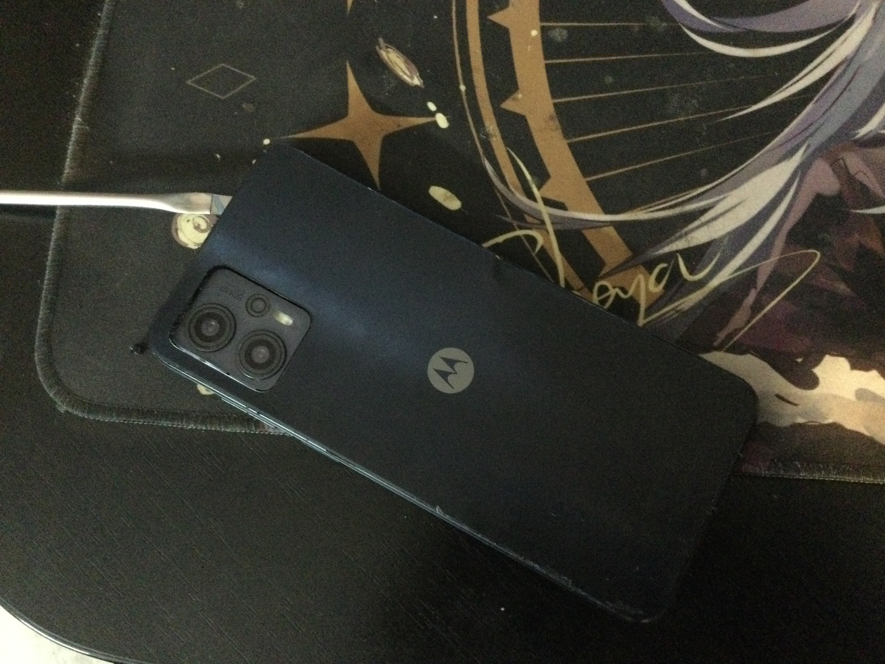
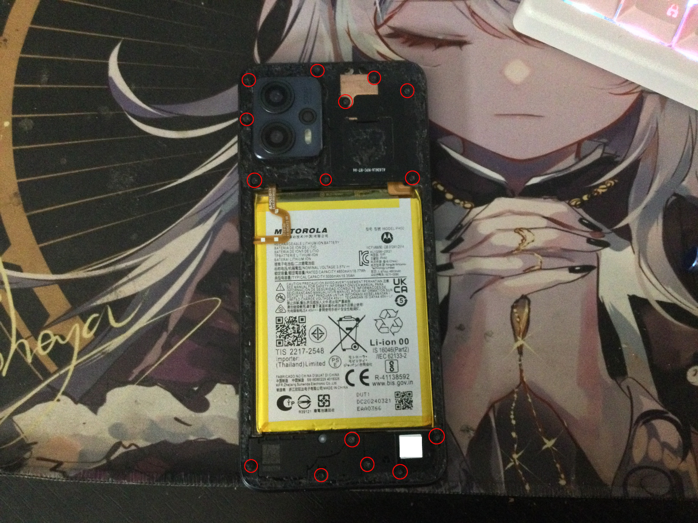
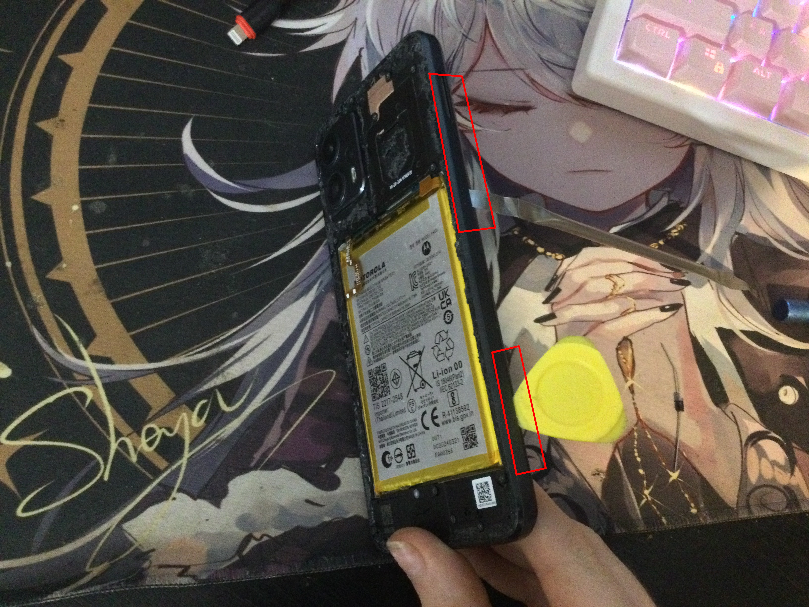
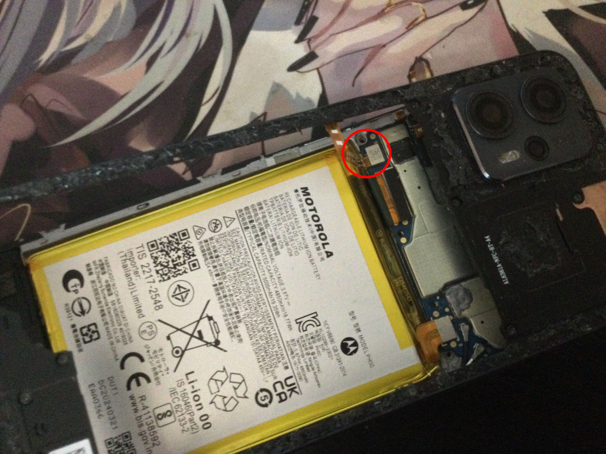

# Disassembly guide
## Required
- **Thin spudger tool for phone disassembly** (≈ 1$ | 42₴)
- **Plastic spudger** (≈ 1$ | 42₴)
- **Hair dryer** or **Hot Air Rework Station**
- **A thin phillips screwdriver** or **screwdriver set**
- Don't be an idiot with crooked hands

## Guide

