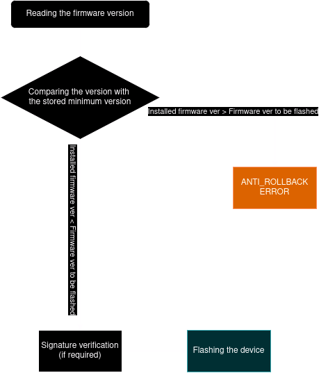

## Firmware rollback
> [!NOTE]
> ANTI_ROLLBACK protection is activated in our device, so this is not possible at the moment!

### What is ANTI_ROLLBACK?
ANTI_ROLLBACK is a mechanism used in devices to prevent the installation of older firmware versions that may be vulnerable or insecure. It checks the firmware version before installing it.

### Is there a workaround?
- The manufacturer can provide a special image to rollback the firmware (Which goodness corporation Motorola will definitely not do)
- Use TWRP to fully format partitions and install ROM through it (Requires unlocking bootloader, which we don't have)
- Say thank you to Motorola