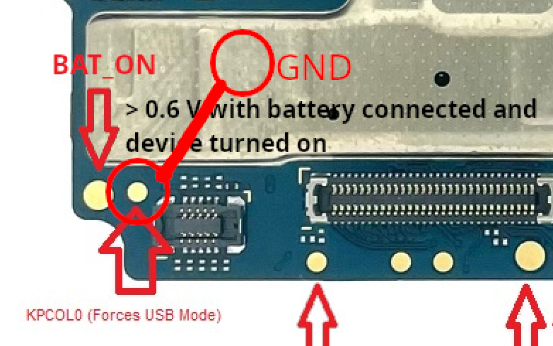
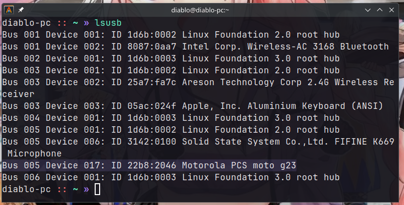
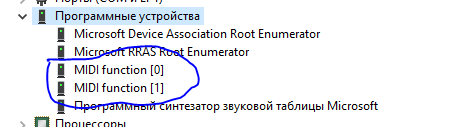

# PCS mode

> [!WARNING]
> We are actively trying to learn more about this mode, if you have any information that you think might be useful - [send a message in the forum topic “PCS Mode”](https://github.com/orgs/moto-penangf/discussions/8)

It's not known what the mode is, we just discovered it by accident

## What is known about this mode
- It's definitely not BROM / Preloader
- MtkClient / FlashTool does not detect the phone after booting into this mode
- If you disconnect the phone from the PC - it will continue to be in this mode
- The phone seems to go into this mode if there is some kind of failure (like a short circuit)
- If you boot the phone to system with USB debugging, the phone will be operated with the same VID, but the PID will still be different

## WTF MIDI?
It turns out that the device VID and PID match when **MIDI mode is enabled without USB debugging**.

However, MIDI is essentially **a communication protocol**. 

Taking into account that the phone switches to this mode in case of hardware failures (e.g. short circuit) and has a special combination to activate the mode even when the phone is off.

Perhaps this protocol is used to organize communication while flashing the device in emergency mode? 

## Boot to PCS mode
There are **three ways** to boot into PCS mode - using the **VOL- button** or using **KPCOL testpoint**

### Using VOL- button
1. Connect the switched off phone to a PC
2. Wait until Preloader mode is disabled and the gray battery icon appears
3. Press and hold the VOL- button until the phone is detected by the computer

### Using TestPoint KPCOL
1. Connect the switched off phone to a PC
2. Wait until Preloader mode is disabled and the gray battery icon appears
3. Short the testpoint KPCOL to GND

### Make a short circuit on the board
> [!WARNING]
> IT'S VERY RISKY! Use other ways, but we have to mention it

In the case of a brief short circuit involving certain non-critical components, such as capacitors, which theoretically should not cause significant damage to the device, **this could be interpreted as a glitch.**

As a result, **the device would forcibly switch to PCS MIDI mode.**

## Phone Detection in PCS Mode
On Linux and Windows, the device is detected differently in this mode

### Linux

### Windows
