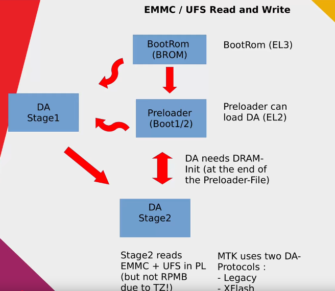

# Preloader mode


MTK Preloader **is a low-level mode activated after the BROM (Boot ROM)** load on MediaTek devices.

It plays a crucial role in the initial boot process, performing several key functions:
- **Hardware Initialization:** The preloader configures critical device components, such as the processor, memory, and ports.
- **Establishing Connection with External Tools:** Via USB, the preloader interacts with programs like SP Flash Tool, enabling the flashing or recovery of the device firmware.
- **Preparation for Bootloader or OS Loading:** After completing the initial tasks, the preloader hands over control to the main bootloader or the operating system.

The Preloader is essential for the flashing process, as without it, the device’s firmware cannot be updated or recovered.

## Boot to Preloader mode
If the Preloader has not been damaged, **it will automatically start when the device is connected to a PC** with the phone disconnected. 

Once connected, **Preloader will wait a few seconds to receive a command or request from an external tool**, e.g. via SP Flash Tool or similar software tool.

If no requests are received within the set timeout, the Preloader **will terminate and the control will move to the next stage of the boot process**, e.g. the main bootloader or the device's operating system.

## Download Agent (DA)
Preloader expects to receive a special DA file, which defines what actions it is allowed to perform.

Unfortunately, modifying the DA file does not grant more rights or access than what is specified in the original configuration, due to the signature check during loading.

This limitation protects the device from unauthorized modifications and ensures the security of the process, which, unfortunately, significantly limits our capabilities and causes issues in this case. :(

## Download Agent authorization (DAA)
It is sufficient to load the Download Agent once to use its commands thereafter. For example, you can load the standard DA agent first, and then load a custom one.

However, it is currently unclear whether commands are executed through the custom agent or if the first loaded agent continues to be used.

```shell
$ mtk printgpt --loader ./sources/MT6768_USER.bin
MTK Flash/Exploit Client Public V2.0.1 (c) B.Kerler 2018-2024

DAconfig - Using custom loader: ./sources/MT6768_USER.bin
Preloader - Status: Waiting for PreLoader VCOM, please reconnect mobile to brom mode

Port - Hint:

Power off the phone before connecting.
For brom mode, press and hold vol up, vol dwn, or all hw buttons and connect usb.
For preloader mode, don't press any hw button and connect usb.
If it is already connected and on, hold power for 10 seconds to reset.


Preloader
Preloader - [LIB]: Status: Handshake failed, retrying...
Port - Device detected :)
...
DaHandler - Device is protected.
DaHandler - Device is in Preloader-Mode.
DAXFlash - Uploading xflash stage 1 from MT6768_USER.bin
DAXFlash - Successfully uploaded stage 1, jumping ..
Preloader - Jumping to 0x200000
Preloader - Jumping to 0x200000: ok.
DAXFlash - Successfully received DA sync
DAXFlash - Uploading stage 2...
DAXFlash - Upload data was accepted. Jumping to stage 2...
DAXFlash - Boot to succeeded.
DAXFlash - Successfully uploaded stage 2
DAXFlash - DA SLA is enabled
No valid sla key found, trying dummy auth ....
SLA Signature was accepted.
...
DAXFlash - [LIB]: Error on sending data: DA hash mismatch (0xc0070004)
DAXFlash
DAXFlash - [LIB]: Error on boot to send_data, addr: 0x68000000
DAXFlash
DAXFlash - [LIB]: DA Extensions failed to enable
...
GPT Table:
-------------
misc:                Offset 0x0000000000008000, Length 0x0000000000080000
                     Flags 0x00000000, UUID f57ad330-39c2-4488-b09b-00cb43c9ccd4, Type EFI_BASIC_DATA
para:                Offset 0x0000000000088000, Length 0x0000000000080000
...
```

### After initially loading the signed DA, we can execute commands without specifying it further

```sh
$ mtk r lk_a lk_a
MTK Flash/Exploit Client Public V2.0.1 (c) B.Kerler 2018-2024

DAXFlash - HW-CODE         : 0x707
DAXFlash - HWSUB-CODE      : 0x8A00
DAXFlash - HW-VERSION      : 0xCA00
DAXFlash - SW-VERSION      : 0x0
DAXFlash - CHIP-EVOLUTION  : 0x1
DAXFlash - DA-VERSION      : 1.0
DaHandler - Requesting available partitions ....
DaHandler - Dumping partition "lk_a"
Progress: |██████████| 100.0% Read (0x1000/0x1000, ) 22.08 MB/s
DaHandler - Dumped sector 933888 with sector count 4096 as lk_a.
```
### After the initial loading of the signed DA, we can attempt to execute commands from another DA. However, it is unclear which one is being used at the moment.
```sh
$ mtk r lk_a lk_a --loader ./sources/MTK_AllInOne_DA.bin
MTK Flash/Exploit Client Public V2.0.1 (c) B.Kerler 2018-2024

DAconfig - Using custom loader: ./sources/MTK_AllInOne_DA.bin
DAXFlash - HW-CODE         : 0x707
DAXFlash - HWSUB-CODE      : 0x8A00
DAXFlash - HW-VERSION      : 0xCA00
DAXFlash - SW-VERSION      : 0x0
DAXFlash - CHIP-EVOLUTION  : 0x1
DAXFlash - DA-VERSION      : 1.0
DaHandler - Requesting available partitions ....
DaHandler - Dumping partition "lk_a"
Progress: |██████████| 100.0% Read (0x1000/0x1000, ) 22.09 MB/s
DaHandler - Dumped sector 933888 with sector count 4096 as lk_a.
```

## Force BROM (Preloader Crash Mode Vulnerability)
Unfortunately, it looks like the firmware contains a patched Preloader, and in the event of a crash, the phone just hangs in Preloader without going to BROM.

```sh
$ mtk brute
MTK Flash/Exploit Client Public V2.0.1 (c) B.Kerler 2018-2024

Main - Kamakiri / DA Bruteforce run
Preloader - Status: Waiting for PreLoader VCOM, please reconnect mobile to brom mode

Port - Hint:

Power off the phone before connecting.
For brom mode, press and hold vol up, vol dwn, or all hw buttons and connect usb.
For preloader mode, don't press any hw button and connect usb.
If it is already connected and on, hold power for 10 seconds to reset.


....Port - Device detected :)
Preloader - Get Target info
Mtk - We're not in bootrom, trying to crash da...
Exploitation - Crashing da...
Preloader
Preloader - [LIB]: upload_data failed with error: Unknown: 0x1d18
Preloader
Preloader - [LIB]: Error on uploading da data
Preloader - Status: Waiting for PreLoader VCOM, please reconnect mobile to brom mode

Port - Hint:

Power off the phone before connecting.
For brom mode, press and hold vol up, vol dwn, or all hw buttons and connect usb.
For preloader mode, don't press any hw button and connect usb.
If it is already connected and on, hold power for 10 seconds to reset.


Preloader
Preloader - [LIB]: Status: Handshake failed, retrying...
Preloader
Preloader - [LIB]: Status: Handshake failed, retrying...
Port - Device detected :)
Preloader - Get Target info
Exploitation - Crashing da...
DeviceClass
DeviceClass - [LIB]: Device disconnected

$ mtk printgpt
MTK Flash/Exploit Client Public V2.0.1 (c) B.Kerler 2018-2024

DaHandler - Please disconnect, start mtkclient and reconnect.
```