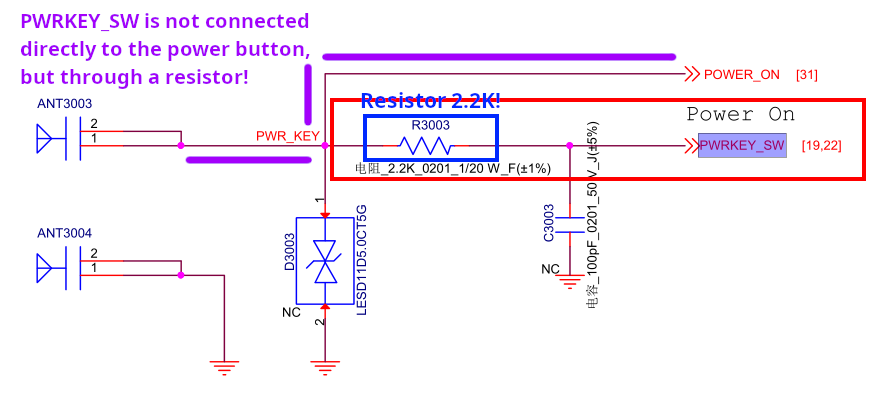
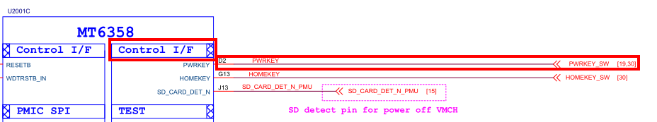
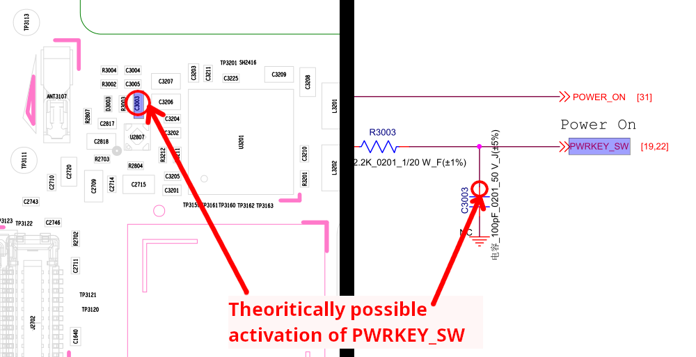

# Control I/F
Control I/F is a control interface that is used to communicate between the processor and other system components such as display controllers, cameras, memory or other peripherals.

It is responsible for coordinating the communication and managing the interaction of these components, ensuring their proper operation and synchronization.

## Table of contents

- [PWRKEY_SW](#pwrkey_sw)
- [HOMEKEY_SW](#homekey_sw)

## PWRKEY_SW
PWRKEY_SW does not have an easily accessible testpoint, it is connected via a 2.2K resistor to the power button and the other end to the PMIC to the “Control I/F” block.

### Using PWRKEY_SW without testpoint?
> [!WARNING]
> This information has not yet been verified. It's just a theory!
>
> Only use this information if you know what you are doing!

Since Motorola hasn't created a testpoint for us to do this, why not use the contact between the capacitor and the PWRKEY_SW line?

## HOMEKEY_SW
HOMEKEY_SW does not have an easily accessible testpoint, it is connected via a 2.2K resistor to the VOL+ button and the other end to the PMIC to the “Control I/F” block.

### Using HOMEKEY_SW without testpoint?
> [!WARNING]
> This information has not yet been verified. It's just a theory!
>
> Only use this information if you know what you are doing!

