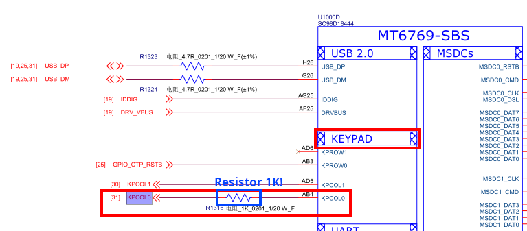
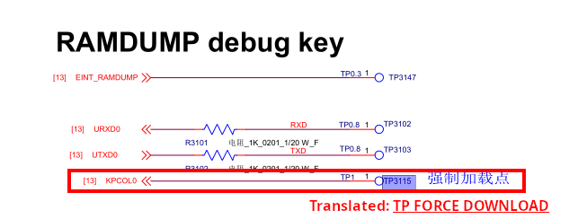
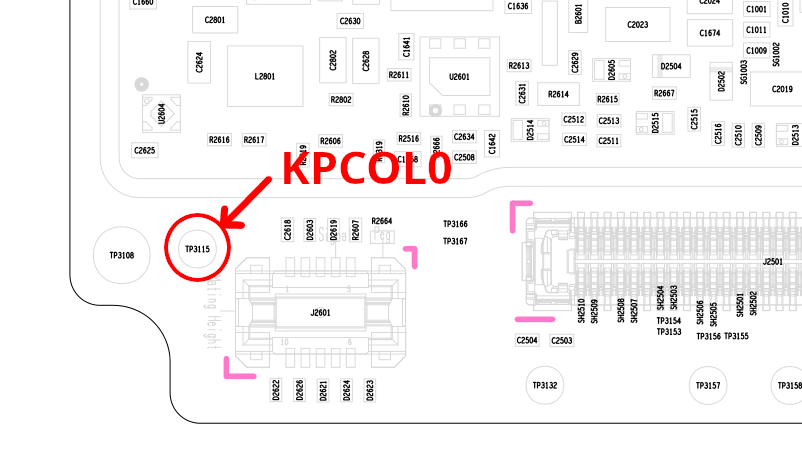
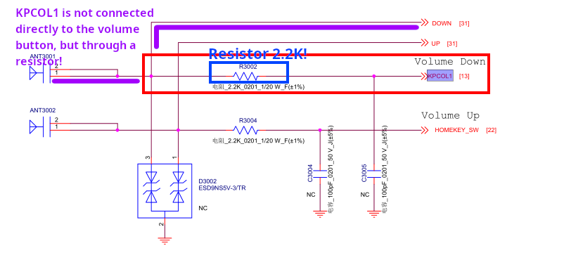
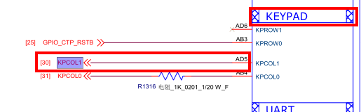
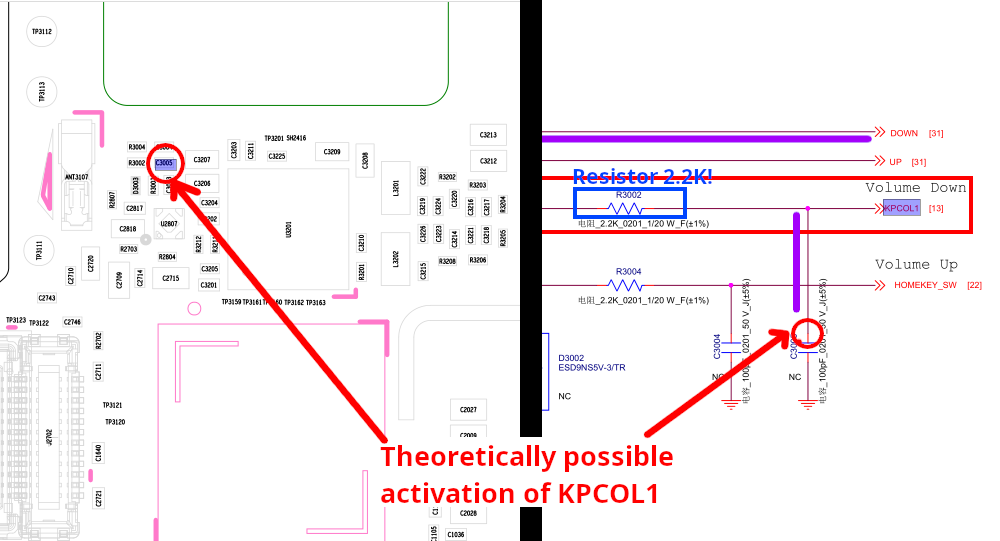

# KEYPAD testpoints
KEYPAD testpoints on MediaTek (MTK) devices are test points associated with the device keyboard that can be used to diagnose and enter certain modes (e.g., Fastboot, BROM, or Download Mode).

## Table of contents

- [What is KPCOL and KPROW?](#what-is-kpcol-and-kprow)
- [KPCOL0](#kpcol0)
- [KPCOL1](#kpcol1)

## What is KPCOL and KPROW?

### KPCOL (Keypad Column)
Lines that are used for the columns of the keypad matrix. They specify the direction of polling in the columns.
### KPROW (Keypad Row)
Lines that are used for the rows of the keypad matrix. They define the row in which the key was pressed.

The hardware keyboard (keypad matrix) connects the rows and columns. When the user presses a button, a specific contact between a row and a column is closed.

## KPCOL0
The KPCOL0 testpoint is connected directly to the SOC (bypassing the volume buttons)

For some reason in the documentation, the testpoint KPCOL0 information is located next to the UART testpoints information and it says “TP FORCE DOWNLOAD” in Chinese.

Located in easy access, near the fingerprint slot

**Perhaps we need to use some combination of test points including KPCOL0 to go to BROM?**

### Testpoint test results
| Action                                                                                            | Result                                                                   |
|---------------------------------------------------------------------------------------------------|--------------------------------------------------------------------------|
| KPCOL0 + GND and connection to a PC                                                               | [Boot to Fastboot mode](../modes/fastboot.md)                            |
| KPCOL0 + GND and connection to PC without battery                                                 | Bootloop in [Preloader mode](../modes/preloader.md), fastboot won't boot |
| Connect to PC and during the picture with gray battery  icon short the testpoint KPCOL0 + GND | [Boot to PCS MIDI mode](../modes/pcs.md)                                 |

## KPCOL1
KPCOL1 testpoint unlike KPCOL0 does not have an available testpoint to activate it and this line is connected to the VOL- volume button via a 2.2K resistor.

### Using KPCOL1 without testpoint?
> [!WARNING]
> This information has not yet been verified. It's just a theory!
>
> Only use this information if you know what you are doing!

Since Motorola hasn't created a testpoint for us to do this, why not use the contact between the capacitor and the KPCOL1 line?

